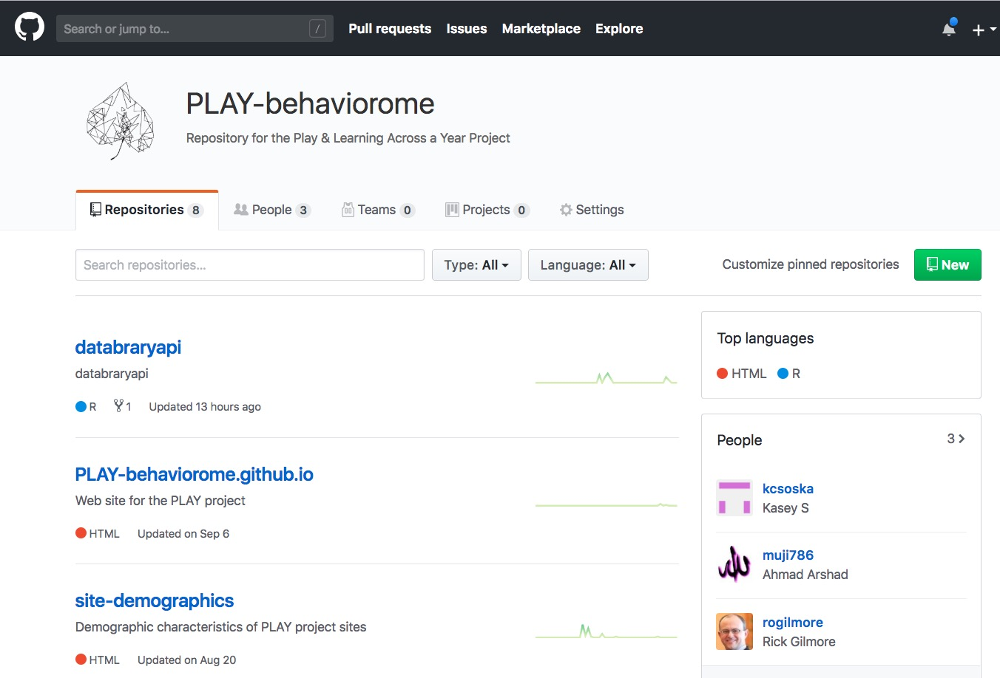

```{r setup, include=FALSE}
knitr::opts_chunk$set(echo = FALSE)

if(!("revealjs" %in% installed.packages()[,1])) {
  install.packages("revealjs") }
require("revealjs")
```

# Preliminaries

---


</br>


</br>


## Open Data and Developmental Science (ODDS) Initiative


<http://csc.la.psu.edu/research/collaborative-research-initiatives>

<!-- The Open Data and Developmental Science (ODDS) Initiative -->

## Agenda

- Motivation
- State of open developmental science
- Needs assessment and future planning

# Motivation

---


Gilmore, R. O. (2016). From big data to deep insight in developmental science. Wiley interdisciplinary reviews. Cognitive science, 7(2), 112–126. Retrieved October 9, 2018, from http://onlinelibrary.wiley.com/doi/10.1002/wcs.1379/full

---

> "*The advancement of detailed and diverse knowledge about the development of the world’s children is essential for improving the health and well-being of humanity. We regard scientific integrity, transparency, and openness as essential for the conduct of research and its application to practice and policy.*"

SRCD Task Force on Scientific Integrity and Openness

---

>"*the principles of human subject research require an analysis of both risks and benefits...such an analysis suggests that researchers may have a positive duty to share data in order to maximize the contribution that individual participants have made.*"

<small>([Brakewood & Poldack, 2013](http://dx.doi.org/10.1016/j.neuroimage.2013.02.040))</small>

# State of open developmental science

## Large-scale research projects

- [ECHO](https://www.nih.gov/research-training/environmental-influences-child-health-outcomes-echo-program)
- PLAY
- ABCD

## Environmental influences on Child Health Outcomes (ECHO)


## Play & Learning Across a Year (PLAY)


---

<div class="centered">
<video width="700" data-autoplay controls>
  <source src="https://nyu.databrary.org/slot/27087/0,79000/asset/119877/download?inline=true" type="video/mp4">
Your browser does not support the video tag.
</video>

$n=900$ 12-, 18-, 24-mo-olds; $n=30$ sites; $n=65$ launch group members

<!-- Video summary of PLAY -->

## PLAY

- Adolph, Tamis-LeMonda, Gilmore (Co-PIs); Buss, Perez-Edgar, Berenbaum, Chi (PSU)
- Video as data and documentation
- 900+ infant/mother dyads, 1-hr video recordings of natural home activity
- Solitary play, dyadic play, video home tour; ambient sound levels
- Demographics, health, language, media use surveys
- All openly (w/researchers) shared on [Databrary.org](http://doi.org/10.17910/B7.724)

---



## Adolescent Brain and Cognitive Development (ABCD) Study


---


<https://data-archive.nimh.nih.gov/abcd>

<!-- ABCD data releases at NIMH/NDA -->

## Goings on at Penn State

- Research computing and cyberinfrastructure [(RCCI)](https://rcci.psu.edu/)
- [ScholarSphere](https://scholarsphere.psu.edu/) and [Data Commons](http://www.datacommons.psu.edu/)
- [R bootcamp](https://psu-psychology.github.io/r-bootcamp-2018/)
- Big data social science [(BDSS)](http://bdss.psu.edu/) initiative
- [Data sciences](https://ist.psu.edu/students/undergrad/majors/ds) major

# Needs assessment and future planning

## Possible areas of activity

- How to meet NIMH data sharing requirements
- Coordinating access to, storage of large-scale datasets (e.g., ABCD)
- Using restricted data: How and why
- R-eproducible research with R and R markdown
- Reproducible workflows in cognitive and affective neuroscience

---

- Support for secondary data analysis
- Ethics of sharing sensitive data
- Data management: It's 12am, do you know where your data are?
- Sharing data across levels of analysis (geo- and other linkages)
- Reproducible workflows with data repositories (e.g., `databraryapi` R package)
- The 5/5/5 proposal
- Data repositories as 'platforms for discovery'
- Video as data and [documentation](https://dev1.ed-projects.nyu.edu/wikis/docuwiki/doku.php/landing): Why and how

## Video and behavioral analysis

> "*Behavior is the critical factor underlying many issues in public health. Behavior contributes to the progression or prevention of disease; it defines disorders or marks recovery; and it provides leverage points for therapeutic intervention.*"

---

> "*Clinicians and health researchers have many tools to measure physical health—from blood assays to brain images. But where are the tools to measure healthy and risky behaviors in the contexts where they naturally occur?*"

---

> "*Video analysis of human behavior is the next frontier in AI, health, and biomedicine.*"

---

<video height="500" controls data-autoplay>
  <source src="https://nyu.databrary.org/slot/11680/0,24500/asset/41871/download?inline=true" type="video/mp4">
Your browser does not support the video tag.
</video>

Jayaraman, S., Smith, L.B., Raudies, F. & Gilmore, R.O. (2014). Natural Scene Statistics of Visual Experience Across Development and Culture. Databrary. Retrieved October 11, 2018 from http://doi.org/10.17910/B7988V

---

<video height="500" controls data-autoplay>
  <source src="mov/Construction.mp4" type="video/mp4">
Your browser does not support the video tag.
</video>

Ossmy, Gilmore, & Adolph (in press)

---

<iframe width="560" height="315" src="https://www.youtube.com/embed/MPU2HistivI" frameborder="0" allow="autoplay; encrypted-media" allowfullscreen></iframe>

<https://pjreddie.com/darknet/yolo/>
<https://www.youtube.com/watch?v=MPU2HistivI&feature=youtu.be>

# Discussion: Where do we want to go? How do we get there?

## What kinds of data do you
    
- Produce/collect yourself
- Gather and analyze from other sources?

## What challenges do you face in
    
- Data collection or gathering?
- Data analysis?
- Data storage or management?
- Data sharing?

## If you share data now, where?

- Federal data repository
- Institutional repository
- Domain repository (e.g., Databrary, ICPSR, OpenNeuro)
- Personal/lab/project/department website

## If you want to share (or share more) data, what barriers must be overcome?

## Are you interested in the video analysis of behavior?

- Reproducible workflows:  <https://gilmore-lab.github.io/2018-10-15-nyu/PLAY-LEGO-report.html>
- PLAY procedure wiki: <https://dev1.ed-projects.nyu.edu/wikis/docuwiki/doku.php/landing>

## Funding opportunities

- [PAR-18-796](https://grants.nih.gov/grants/guide/pa-files/PAR-18-796.html)
- [PAR-18-896](https://grants.nih.gov/grants/guide/pa-files/PAR-18-896.html)

# Resources

---

This talk was produced on `r Sys.time()` in [RStudio 1.1.453](http://rstudio.com) using R Markdown and the reveal.JS framework.
The code and materials used to generate the slides may be found at <https://github.com/gilmore-lab/DEVSEC-2018/promise-of-open-dev-sci/>. 
Information about the R Session that produced the slides is as follows:

---

```{r session-info}
sessionInfo()
```
